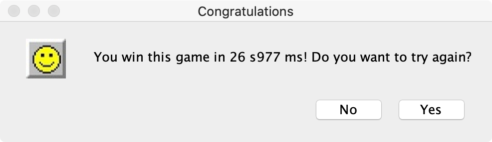

# Minesweeper

This is a Java implementation of the popular game Minesweeper.


## Description

In Minesweeper, the player is initially presented with a game board of undifferentiated tiles. Either some randomly-selected tiles or seed-selected tiles are designated to contain mines. Typically, the size of the game board and the number of mines are set in advance by the user or by a seed file. The ratio of the number of mines to the game board size is often used as a measure of an individual game's difficulty. The board size can also be represented in terms of the number of rows and columns in the grid.


### Functionalities

1. Provide several difficulty levels of the game: for beginner, for intermediate, and for advanced.
2. Support for the customed board (i.e., you can set up the size of game board and the number of bombs by yourself).
3. Display an image of a bomb if tile has a bomb on it and the player clicks the left mouse.
4. Display the number of bombs in surrounding tiles if the player clicks the left mouse.
5. Display a red flag if the player single clicks the right mouse.
6. Display a question mark for unknown if the player double clicks the right mouse.
7. Display all bombs and tiles with wrong operations if the player mistouches the bomb.


## How to Play the Game

To run this game, first run the following to compile:

```java
javac *.java
```

Then you can use the following java command to run the game:

```java
java Play.java
```


### Screen Shot



